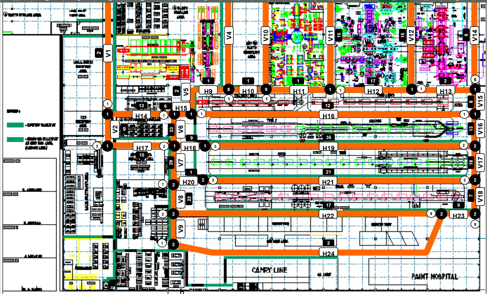
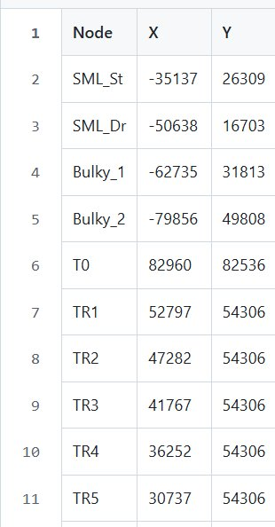
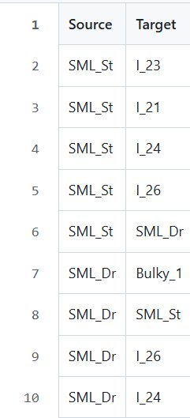
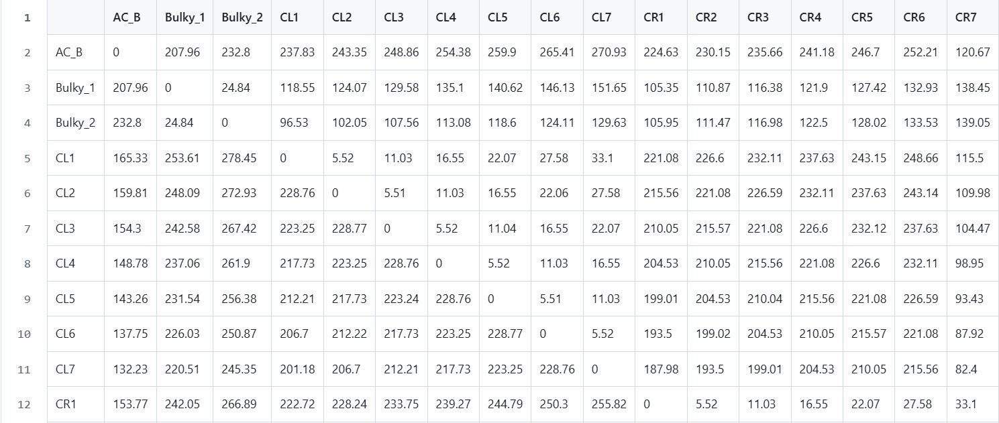
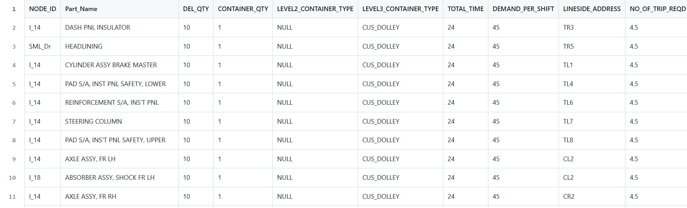
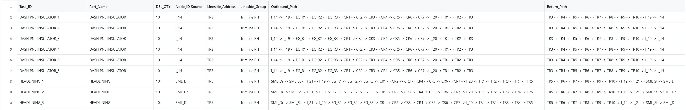
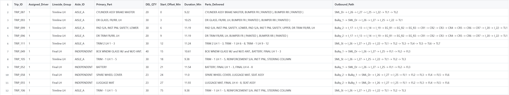
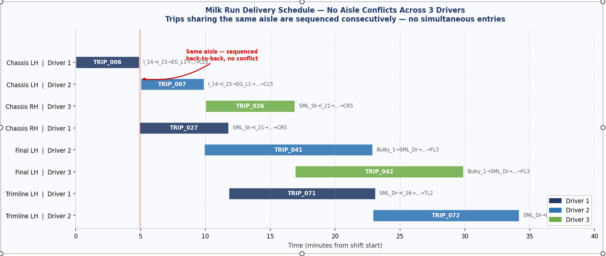

# Automated JIT Logistics & Routing Optimisation
### Digitising Toyota IE Planning Logic into a Python Optimisation Engine

**Role:** Group Head — Logistics Planning Group
**Project Type:** Micro-Logistics Optimisation & Resource Planning

---

> [!IMPORTANT]
> ## Key Result: 40% Fleet Efficiency Gain
> | Metric | Manual Planning | Optimised Engine |
> |---|---|---|
> | Drivers / Tuggers Required | **5** | **3** |
> | Driver Utilisation | Unknown / untracked | **86%** |
> | Total Work Content (per shift) | Estimated manually | **70,079 seconds — mathematically proven** |
> | Planning Method | Iterative, recalculated manually | **Automated — reruns in seconds** |
> | SKUs Managed | 54 parts | 54 parts |
> | Delivery Trips Generated | Manual estimate | **109 synchronised milk-run trips** |
> | Production Lines Covered | 9 line groups | 9 line groups |

---

## What This Project Does — In One Sentence

It takes the complex, time-intensive manual process an Industrial Engineer uses to plan JIT parts delivery in a Toyota assembly plant — and replaces it with a Python engine that produces the same output in seconds, with mathematical proof of the minimum fleet required.

---

## From Physical Plant to Digital Model

The foundation of this project is a faithful digital reconstruction of the real factory floor — every aisle, workstation, and intersection translated into a mathematical graph the optimisation engine can reason about.

### The Physical Plant — Source CAD Layout

This is the actual Toyota assembly plant layout the logistics network was designed from. It shows the four production lines (Chassis, Trim, Final, Engine), warehouse and staging areas, and the physical aisles that constrain all delivery routing.


### Factory Aisle Network — Directional Constraints & Node Labels

The image below shows all the aisles and intersections of the factory floor, each labelled with a code — **H** for horizontal aisles, **V** for vertical aisles, and **I** for intersections. Numbers on each label identify the specific aisle or intersection (e.g. H16, V6, I_18). Critically, many of these aisles have directional restrictions — a horizontal aisle may only permit travel left or right, and a vertical aisle may only permit travel north or south. These one-way constraints, together with the measured distance between each node (the edge weight), are what was encoded into Dijkstra's Algorithm. The algorithm then finds the shortest legally possible path between any two nodes — never routing a driver against a one-way restriction.



### The Digitised Factory Graph — NetworkX DiGraph

Every node was extracted from the CAD layout and mapped to a coordinate system. Directed edges enforce one-way aisle constraints. Edge weights are real distances in metres. The result is a mathematical representation of the shop floor that the optimisation engine uses as its spatial foundation.


> **What you are seeing:** Each circle is a physical location on the shop floor. Arrows show legal one-way travel paths. Numbers are distances in metres. The routing engine can only use paths that exist in this graph — illegal shortcuts are mathematically impossible.

---

## How the Engine Works — 4-Stage Pipeline

```
┌─────────────────────┐     ┌─────────────────────┐     ┌─────────────────────┐     ┌─────────────────────┐
│   STAGE 1           │     │   STAGE 2           │     │   STAGE 3           │     │   STAGE 4           │
│   Spatial Mapping   │────▶│  Workload Modelling │────▶│  Route Optimisation │────▶│  Fleet Sizing       │
│                     │     │                     │     │                     │     │                     │
│ • CAD → coordinates │     │ • 54 SKUs exploded  │     │ • Geographic        │     │ • Total man-seconds │
│ • Node classification     │   into task list    │     │   clustering        │     │   summed across     │
│ • Directed edges    │     │ • Gentan-i time     │     │ • No duplicate      │     │   450-min shift     │
│   (one-way aisles)  │     │   standards applied │     │   parts per trip    │     │ • Minimum drivers   │
│ • Dijkstra shortest │     │ • Travel + service  │     │ • Traffic conflict  │     │   calculated:       │
│   path → distance   │     │   time calculated   │     │   prevention        │     │   3 drivers @ 86%   │
│   matrix            │     │   per delivery      │     │ • 109 milk-run      │     │   utilisation       │
│                     │     │                     │     │   trips generated   │     │                     │
│ Output: Distance    │     │ Output: Exploded    │     │ Output: Milk Run    │     │ Output: Proven      │
│ Matrix (N×N)        │     │ Task List           │     │ Delivery Groups     │     │ fleet size          │
└─────────────────────┘     └─────────────────────┘     └─────────────────────┘     └─────────────────────┘
```

---

## Section 1 — Digital Geography & Pathing Logic

To digitise the physical environment, the plant CAD layout was translated into a structured coordinate system, forming the spatial foundation of the routing engine.

### 1.1 Spatial Node Mapping

Extracted (x, y) coordinates from the plant layout to define all critical nodes — warehouse staging areas, line-side delivery stations, and intersection points.



**Node Classification — Code Reference:**

To maintain high-fidelity with the physical shop floor, every node was assigned a classification code:

| Code | Description |
|---|---|
| `TR` / `TL` | Trim Line Station — Right Hand Side / Left Hand Side |
| `CR` / `CL` | Chassis Line Station — Right Hand Side / Left Hand Side |
| `FR` / `FL` | Final Line Station — Right Hand Side / Left Hand Side |
| `EG_R` / `EG_L` | Engine Line Station — Right Hand Side / Left Hand Side |
| `T0` | Trim Zero — Start of Assembly Line |
| `AC_B` | Aircon Building |
| `SML_Dr` | Small Parts Drop-Off Point |
| `SML_St` | Small Parts Delivery Staging Area |
| `Bulky_1` / `Bulky_2` | Bulky Parts Staging Area No. 1 / No. 2 |
| `I_XX` | Intersection Node (e.g. I_17 = Intersection No. 17) |

**Output:** `Node_coordinates.csv`

---

### 1.2 Directed Edge (Path) Construction — Routing Logic

Defined the logical From→To connections between nodes to mathematically enforce the physical flow of the facility. By using Directed Edges, the routing engine strictly respects one-way aisle constraints and prevents illegal backward movements.



> **What this means on the shop floor:** If an aisle only allows travel from Node A to Node B, the graph contains that edge only. The engine cannot route a driver in the reverse direction — the same constraint a tugger driver faces in real life.

**Output:** `From_To.csv`

---

### 1.3 Graph Visualisation of the Shop-Floor Layout

The NetworkX library was used to build a Directed Graph (DiGraph) of the factory floor. This allowed visual verification of edge weights (distances) and flow directionality before running any optimisation.


**Script:** `factory_floor_layout.py`

---

### 1.4 Distance Matrix Generation — Shortest Path Between All Nodes

Dijkstra's Algorithm was applied to calculate the absolute shortest legal path between every node pair. The result is an N×N Distance Matrix — the primary spatial input for the optimisation solver. Every distance in this matrix is the shortest physically possible route respecting all one-way constraints.



> **How to read this:** Each cell shows the shortest legal travel distance in metres between two nodes. For example, the distance from `Bulky_1` to `CL1` is 118.55 metres — the shortest path the engine can legally route a driver through the real aisle network.

**Script:** `master_distance_matrix.py`
**Output:** `Distance_Matrix.csv`

---

## Section 2 — Workload Modelling & Service Standards (Gentan-i)

To determine the optimal fleet size for any given production demand, the precise Work Content for every delivery cycle was calculated. This phase translated physical handling constraints into high-fidelity time standards.

> [!NOTE]
> **Sensitivity Analysis Input Point:** This is the stage where production demand variables (Takt Time, delivery frequency, SKU mix) can be adjusted before running subsequent scripts — allowing rapid scenario analysis without re-engineering the network.

### 2.1 Service Time Standardisation

SKU-specific container types (Dunnage, Regular Dollies, Custom Dollies) were mapped to their respective standard unloading and loading times. Vehicle travel speed was calibrated at **1.6 seconds per metre** (Gentan-i standard). The scope was focused on a specific vehicle-model segment within a Mixed-Model Production System to simulate high-complexity delivery requirements.



**Output:** `Demand.csv` — 54 SKUs with container type, delivery quantity, demand per shift, and number of trips required

---

### 2.2 Workload Explosion

Generated a comprehensive task list by intersecting delivery frequencies (10, 50, and 100-minute cycles for the current Takt time) with standardised service times and required trip counts. This exploded the data into individual work elements — each with travel time, service duration, outbound path, and return path — to calculate total required man-seconds across the shift.



> **What you are seeing:** Each row is one individual delivery trip for one part, to one lineside address, with the full node-by-node outbound and return routing path calculated. The engine generates this for all 54 SKUs across all delivery cycles automatically.

**Script:** `delivery_tasks_list.py`
**Output:** `Exploded_Task_List.csv`

---

### 2.3 Spatial Validation

All generated delivery routes and calculated travel times were cross-referenced against the factory DiGraph to ensure 100% alignment with physical aisle constraints. No route in the exploded task list uses a path that does not exist in the graph.

**Validation:** Factory graph visualisation vs `Exploded_Task_List.csv` — zero discrepancies.

---

## Section 3 — Constraint-Based Routing Optimisation (CVRP)

A standardised 3-slot batch constraint was used to aggregate the exploded task list into synchronised Milk Run trips. This stage focused on maximising tow-tractor utilisation while respecting physical line-side space and equipment payload limits.

### 3.1 Intelligent Trip Bundling and Levelled Deliveries (Heijunka)

A grouping algorithm aggregates individual deliveries into unified trips based on four constraints applied simultaneously:

| Constraint | Shop-Floor Logic | How It Was Encoded |
|---|---|---|
| **Geographic Clustering** | Group tasks by shared line-side zone to eliminate redundant travel (Muda) | Tasks sorted by `Lineside_Group` before bundling |
| **Unified Path Physics** | Use only the furthest node in a bundle to calculate round-trip duration — prevents distance double-counting | Furthest node identified per bundle; single round-trip calculated |
| **No Duplicate Parts** | Respect limited rack footprint at each workstation | Hard constraint — no part appears twice in the same trip |
| **Traffic Conflict Prevention** | No simultaneous deliveries on the same aisle | Conflict detection across all concurrent trips before assignment |

**Script:** `delivery_bundling_levelled_with_traffic_check.py`



> **What you are seeing:** Each row is one complete optimised milk-run trip — with assigned driver, aisle classification, scheduled start offset, duration, parts delivered, and the full outbound routing path. The engine generates all 109 trips simultaneously, levelled across the shift.

**Output:** `Milk_Run_Delivery_Groups.csv`

---

### 3.2 Delivery Schedule — No Aisle Conflicts (Gantt Chart)

The Gantt chart below shows a sample of 8 trips across 4 line groups and 3 drivers. Each colour represents one driver. Trips sharing the same aisle are sequenced back-to-back — never simultaneously — proving the traffic conflict prevention constraint is working correctly across the full schedule.



> **What you are seeing:** Each horizontal bar is one milk-run trip. The x-axis is time in minutes from shift start. Trips on the same aisle (e.g. TRIP_006 and TRIP_007 on Chassis LH) are assigned to different drivers and sequenced so they never occupy the same aisle at the same time. The engine enforces this for all 109 trips automatically — zero manual checking required.

---

### 3.3 Quantified Resource Reduction

By aggregating total required man-seconds (travel + service) across the 450-minute shift, the engine mathematically determined the minimum required fleet size.

> [!IMPORTANT]
> ### Fleet Sizing Result
> | | Value |
> |---|---|
> | Total Work Content | **70,079.86 seconds** |
> | Theoretical Headcount | **2.60 drivers** |
> | Actual Requirement | **3 drivers** |
> | Driver Utilisation | **86%** |
> | Reduction vs Manual Planning | **5 drivers → 3 drivers (40% efficiency gain)** |
>
> The optimisation engine proved that the plant's full production demand across 9 line groups and 54 SKUs can be met with 3 drivers — each operating at 86% utilisation — compared to the 5 drivers determined by manual planning.

---

## Constraints Engineered Into the System

These are the shop-floor rules that were translated into algorithmic constraints — the same rules an experienced IE planner carries in their head, now enforced mathematically:

| Shop-Floor Rule | How It Was Encoded |
|---|---|
| One-way aisles | Directed edges in NetworkX DiGraph — illegal paths do not exist in the graph |
| No duplicate parts per trip | Hard constraint in bundling algorithm — enforces lineside rack space limits |
| No simultaneous deliveries on same aisle | Traffic conflict detection across all concurrent trips |
| Takt-synchronised delivery frequency | Delivery cycles (10, 50, 100-min) derived from current Takt time |
| Container type determines service time | Gentan-i standards mapped per SKU container type |
| Furthest-node travel calculation | Single round-trip per bundle — eliminates distance double-counting |

---

## Why This Matters Beyond Toyota

The logic in this engine is **industry-agnostic**. The same four-stage pipeline applies to any facility where synchronised point-of-use delivery is required:

| Industry | Application |
|---|---|
| **Mining** | Scheduled parts delivery to drill rigs or processing stations on timed cycles |
| **Distribution Centres** | Milk-run replenishment from bulk storage to pick faces |
| **Hospitals** | Sterile supplies delivery to operating theatres on timed cycles |
| **Truck Body Manufacturing** | Sub-assembly kitting delivery to fabrication workstations |
| **Heavy Equipment** | Component delivery to assembly bays with shared aisle constraints |

The inputs change. The logic — spatial mapping, workload explosion, route bundling, fleet sizing — stays the same.

---

## Tech Stack

| Tool | Purpose |
|---|---|
| **Python** | Core logic, automation, constraint enforcement |
| **NetworkX** | Factory floor DiGraph, Dijkstra shortest-path, graph visualisation |
| **Pandas / NumPy** | Data manipulation, task explosion, matrix mathematics |
| **Custom Bundling Engine** | Constraint-based trip aggregation and traffic conflict detection |

---

## Project Files

| File | Description |
|---|---|
| `factory_floor_layout.py` | Builds the NetworkX DiGraph from node coordinates and directed edges |
| `master_distance_matrix.py` | Runs Dijkstra's Algorithm — generates full N×N distance matrix |
| `delivery_tasks_list.py` | Explodes demand data into individual work elements with travel + service times |
| `delivery_bundling_levelled_with_traffic_check.py` | Groups tasks into optimised milk-run trips with conflict detection |
| `data/Factory_CAD_layout.png` | Source plant layout used for node coordinate extraction |
| `data/factory_floor_layout_cartesian.png` | Digitised factory graph — visual verification of routing logic |
| `data/Node_coordinates.csv` | (x, y) coordinates for all nodes |
| `data/From_To.csv` | Directed edge definitions (legal paths between nodes) |
| `data/Distance_Matrix.csv` | N×N shortest-path distance matrix output |
| `data/Demand.csv` | SKU demand input — 54 parts, delivery frequencies, container types |
| `data/Exploded_Task_List.csv` | Full task breakdown with routing paths and time calculations |
| `data/Milk_Run_Delivery_Groups.csv` | Final output — 109 optimised milk-run trips across 9 line groups |

---

> **Confidentiality Note:** This project uses actual Toyota IE planning methodology and operational flow logic. Plant location and specific production model identifiers have been anonymised. Distances, aisle constraints, and service-time variables represent a verified, functional shop-floor environment.

---

[← Back to Main Portfolio](../../README.md)
